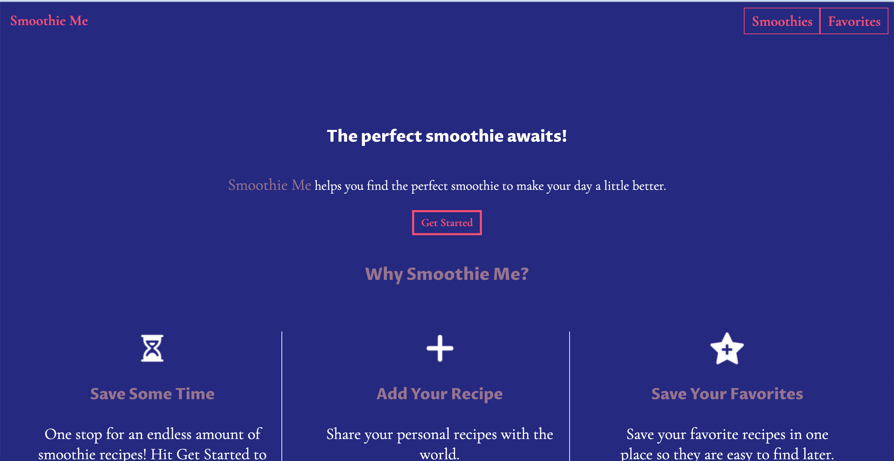
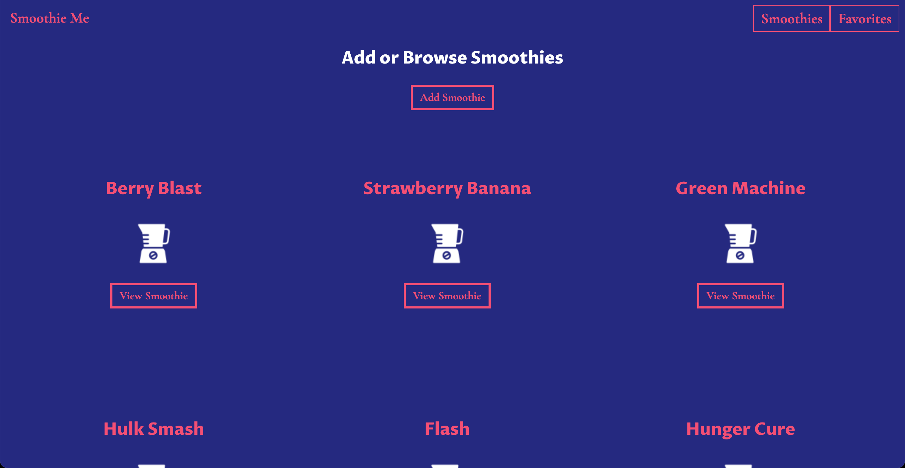
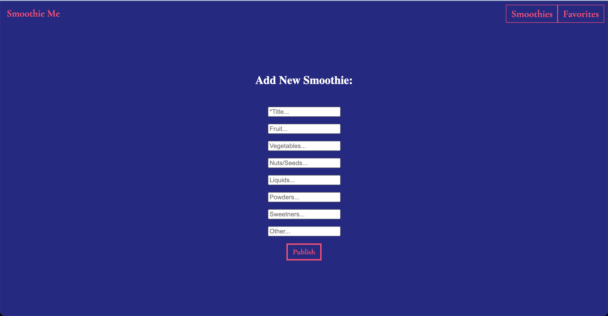
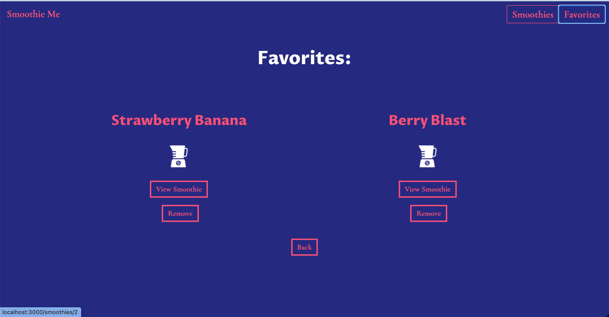

<h1>Smoothie Me</h1>

Smoothie Me helps you find the perfect smoothie to make your day a little better 

Click the 'Get Started' button and find your perfect smoothie.

<h2>Landing Page</h2>

 The landing page houses an explanation of why this app is useful and how to use it.

 There is also a 'Get Started' button which will take the user to the page where they can find a list of smoothies.

<h2>Smoothies Page</h2>

 The smoothies page shows the user a list of all the smoothies availlable. From here the user can click on a specific smoothie
to view the ingredients of that smoothie.

<h2>Add Smoothie Page</h2>

Here there is a from for users to submit a new smoothie recipe.

<h2>Favorites Page</h2>

Here is a list of the smoothies that were saved as favorites.

<ul>
    <li>
        <a href='https://smoothie-me.vercel.app/'>Live link</a>
    </li>
    <li>
        <a href='https://github.com/tharwin-carr/smoothie-me-api'>API Repo</a>
    </li>
</ul>

Tech used: PostgreSQL, Express, React, Node (PERN)
